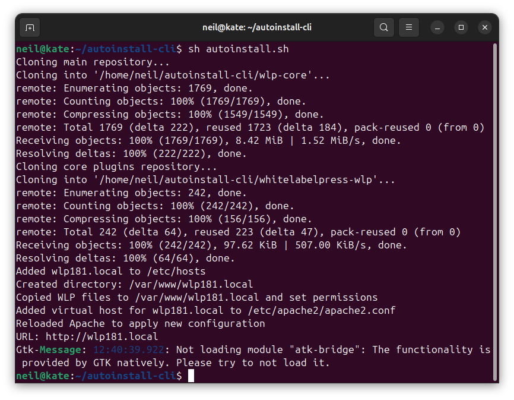

# autoinstall-cli
Autoinstall CLI Tool to install WLP with most ease &amp; joy.




## Usage:
```
git clone https://github.com/wlp-builders/autoinstall-cli.git && cd autoinstall-cli
sh autoinstall.sh # downloads and installs wlp core + whitelabelpress-wlp to /var/www/wlp{count}.local and fixes apache2 + /etc/hosts file
```
 
#### What will it do:
- clones wlp-core + whitelabelpress-wlp from GitHub
- creates /etc/hosts record for wlp{nr}.local
- creates /etc/apache2/apache2.conf virtual host for wlp{nr}.local
- installs wlp to /var/www/wlp{nr}.local 
- open the auto install+login url with firefox


#### If you're on a server:
```
git clone https://github.com/wlp-builders/autoinstall-cli.git && cd autoinstall-cli
sh autoinstall-server.sh [domain.tld] # does the same without firefox, afterwards see your wlp-config.php file for admin password (same as db) 
```
