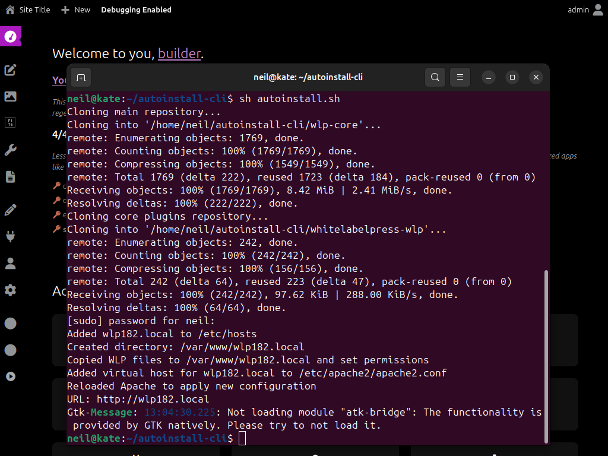

# autoinstall-cli
Autoinstall CLI Tool to install WLP with most ease &amp; joy.




## Usage:
Note: You need to have your LAMP (Linux Apache2 MySQL PHP) configured. If you need to do this first see (Install LAMP) below.
```
git clone https://github.com/wlp-builders/autoinstall-cli.git && cd autoinstall-cli
sh autoinstall.sh # downloads and installs wlp core + whitelabelpress-wlp to /var/www/wlp{count}.local and fixes apache2 + /etc/hosts file
```
 
#### What will it do:
- clones wlp-core + whitelabelpress-wlp from GitHub
- creates /etc/hosts record for wlp{nr}.local
- creates /etc/apache2/apache2.conf virtual host for wlp{nr}.local
- installs wlp to /var/www/wlp{nr}.local 
- open the auto install+login url with firefox


#### If you're on a server:
```
git clone https://github.com/wlp-builders/autoinstall-cli.git && cd autoinstall-cli
sh autoinstall-server.sh [domain.tld] # does the same without firefox, afterwards see your wlp-config.php file for admin password (same as db) 
```

### Install LAMP
Open your terminal of choice and copy-paste (shift+v) + enter:
```
sudo apt-get update && apt-get install -y \
    sudo \
    apache2 \
    openssh-server \
    mysql-server \
    php \
  php-mysql \
    php-bcmath \
    php-curl \
    php-xml \
    php-mbstring \
    php-json \
    php-zip \
    php-soap \
    php-intl \
    curl \
    wget \
    git \
    unzip \
    && apt-get clean
```
